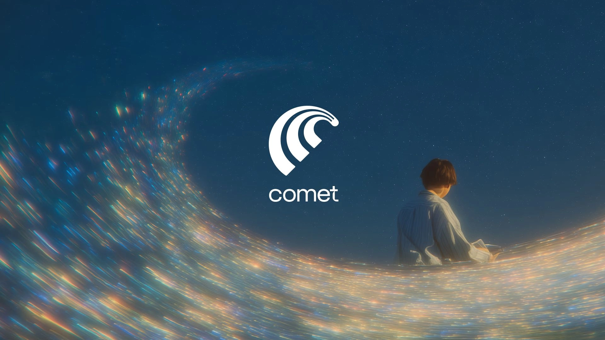
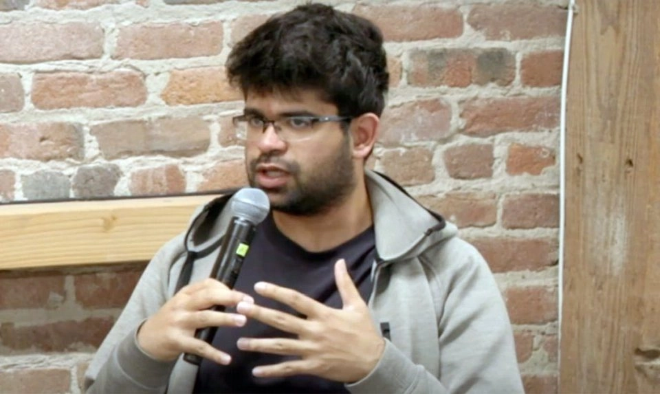

# Perplexity推出Comet浏览器：用AI重新定义上网方式

---

如果你厌倦了在一堆搜索结果里翻来翻去，或者想让浏览器真正"听懂"你在说什么，那这个消息可能值得关注。AI搜索公司Perplexity刚刚发布了一款叫Comet的新浏览器，主打语音、文本和应用集成——简单说，就是让你用说话或打字的方式直接问问题，浏览器帮你搞定剩下的事。这款产品面向Perplexity Max订阅用户，月费200美元，今年夏天开始邀请制内测。

---

## Comet是什么?一个会"听话"的浏览器

周三发布的演示视频里，用户对着Comet说话或打字提问,浏览器直接给出答案,还能连接Slack这类企业工具。Perplexity在博客里说得很直白:"我们做Comet,是为了让互联网做它一直想做的事——放大人类智能。"

听起来有点玄?其实核心逻辑挺简单:传统浏览器只是个"展示工具",你得自己去找、去筛、去操作。Comet想做的是把AI助手直接塞进浏览器里,让它记住你的习惯、理解你的需求、帮你完成动作。

比如你问"上周那个客户发的文件在哪",它能从Slack里翻出来;或者你说"帮我总结这篇报告的重点",它直接给你提炼好。这不是搜索引擎的逻辑,更像是个随时待命的助理。

## 为什么现在推出?时机和野心

Comet的发布时间点挺微妙。两周前有消息说苹果在和Perplexity谈收购,理由是"需要更多AI人才和技术"。虽然没下文,但这事儿本身说明Perplexity的技术路线引起了巨头注意。

今年5月,Perplexity据说在谈一轮5亿美元融资,估值140亿美元。更早些时候,Meta也找过他们聊收购,不过没谈成。这些动作背后,是AI搜索赛道越来越拥挤的现实——Google在Chrome里加AI助手,微软Edge也在猛推Copilot,Perplexity如果只守着搜索引擎,空间会越来越窄。

所以Comet的逻辑很清楚:与其等着被巨头挤压,不如直接做浏览器,把AI能力延伸到整个上网体验里。这不是防守,是进攻。

👉 [想了解Perplexity如何用AI改变搜索体验?点这里看更多](https://pplx.ai/ixkwood69619635)

## Perplexity的底气从哪来?

Perplexity是2022年由几个前Google和OpenAI工程师创立的。他们做的事情很简单:你问问题,它直接给答案,还标注信息来源。不是一堆链接让你自己点,而是把答案整理好端给你。

这个模式去年火了,但也惹了麻烦。有媒体指控Perplexity抓取内容后没给足够署名,后来公司推出了和出版商的收益分成机制。争议归争议,产品本身确实有人用——快、准、省事。

现在做浏览器,其实是把这套逻辑往前推了一步:搜索只是上网的一部分,如果AI能渗透到浏览、操作、协作的每个环节,体验会彻底不一样。

## 200美元一个月,谁会买单?

这是个现实问题。Comet目前只对Perplexity Max订阅用户开放,月费200美元,还得排队等邀请。这个价格不便宜,但Perplexity显然不是冲着大众市场去的——至少现在不是。

更可能的用户画像是:需要频繁处理信息、跨工具协作、对效率有极高要求的专业人士。比如投资人、研究员、产品经理、内容创作者。对这些人来说,如果Comet真能省下每天一两小时的重复劳动,200美元可能不算贵。

当然,产品得真的好用才行。现在还是内测阶段,实际表现如何,得等更多人用了才知道。

## 这事儿能成吗?

坦白说,挑战不小。Google Chrome占了全球浏览器市场的六成以上,用户习惯很难改。微软Edge背靠Windows生态,也在猛推AI功能。Perplexity要从零开始建立用户基础,光靠"更智能"这个卖点,不一定够。

但也不是没机会。浏览器市场看起来稳固,其实一直有人在尝试突破——Arc浏览器靠设计和工作流创新吸引了一批忠实用户,Brave靠隐私保护站稳了脚跟。Perplexity如果能把AI能力做到真正实用,而不是噱头,可能会撬动一部分对现有工具不满意的人。

另一个变量是企业市场。如果Comet能和Slack、Notion、Google Workspace这些工具深度整合,成为团队协作的中枢,那想象空间就大了。毕竟企业用户对价格没那么敏感,更在乎效率和整合度。

## 最后说两句

Perplexity做Comet,本质上是在赌一个方向:未来的浏览器不该只是个"窗口",而应该是个"助手"。这个方向对不对,现在还说不准。但至少他们在动手做,而不是等着被巨头碾过去。

👉 [如果你对AI如何改变日常工具感兴趣,可以看看Perplexity的更多尝试](https://pplx.ai/ixkwood69619635)

---

## 结语

Comet还在早期,能不能真正撼动Chrome和Edge,得看产品迭代和用户反馈。但Perplexity的思路值得关注:与其在搜索引擎的红海里挤,不如直接重新定义"上网"这件事。对于需要高效处理信息、频繁跨工具协作的专业用户来说,一个真正智能的浏览器,可能比又一个搜索引擎更有吸引力。
